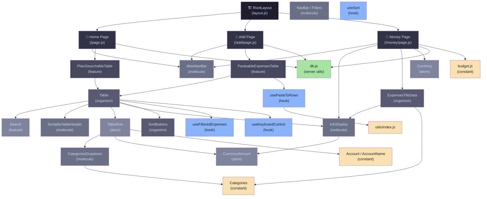

# Component Architecture

## Diagram



## Layers

| Layer | Components |
|---|---|
| **Pages** | `RootLayout`, `Home`, `Add`, `Money` |
| **Features** | `PlainSearchableTable`, `PasteableExpensesTable` |
| **Organisms** | `Table`, `ExpensesTileData`, `SortButtons` |
| **Molecules** | `MainNavBar`, `NavBar`, `InfoDisplay`, `CategoriesDropdown`, `SortableTableHeader` |
| **Atoms** | `TableRow`, `CurrencyAmount`, `Currency`, `Search` |
| **Hooks** | `useFilteredExpenses`, `usePasteToRows`, `useKeyboardControl`, `useSort` |
| **Server/Utils** | `db.js`, `utils/index.js`, `Categories`, `Account`, `Budget` |

## Pages

| Route | File | Description |
|---|---|---|
| `/` | `src/app/page.js` | Dashboard — searchable/filterable expense table |
| `/add` | `src/app/add/page.js` | Paste-to-add unhandled expenses |
| `/money` | `src/app/money/page.js` | Monthly budget overview with income/expense breakdown |

## Components

### Atoms

- **`CurrencyAmount`** (`src/components/atoms/currency-amount.jsx`) — Formatted currency display with optional positive/negative color coding
- **`TableRow`** (`src/components/atoms/table-row.jsx`) — Single expense row with inline category/note editing and delete

### Molecules

- **`MainNavBar`** (`src/components/molecules/MainNavBar.jsx`) — Top navigation between Home / Add / Money pages
- **`NavBar`** (`src/components/molecules/navbar.jsx`) — URL-driven filter bar (account, year, month, category)
- **`InfoDisplay`** (`src/components/molecules/info-display.jsx`) — Labeled metric tile with progress bar and percentage
- **`CategoriesDropdown`** (`src/components/molecules/categories-dropdown.jsx`) — Category picker grid using Hebrew locale labels
- **`SortableTableHeader`** (`src/components/molecules/sortable-table-header.jsx`) — Table column header with sort toggle

### Organisms

- **`Table`** (`src/components/organisms/table.jsx`) — Full expense table with search, sort, filter, and per-account/category totals
- **`ExpensesTileData`** (`src/components/organisms/ExpensesTileData.jsx`) — Grid of category spend tiles (actual vs. budgeted)
- **`SortButtons`** (`src/components/organisms/SortButtons.jsx`) — Amount/date sort controls

### Features

- **`PlainSearchableTable`** (`src/features/PlainSearchableTable/index.jsx`) — Table with horizontal category column scrolling
- **`PasteableExpensesTable`** (`src/features/PasteableExpensesTable/index.jsx`) — Table that accepts clipboard paste input and deduplicates against existing expenses
- **`Search`** (`src/features/Search/index.jsx`) — Real-time text search with amount fuzzy matching (±5%)

## Hooks

| Hook | File | Purpose |
|---|---|---|
| `useFilteredExpenses` | `src/hooks/useFilteredExpenses.js` | Filter rows by account/category, sort, compute totals |
| `usePasteToRows` | `src/features/PasteableExpensesTable/usePasteToRows.js` | Parse clipboard paste into expense rows, deduplicate |
| `useKeyboardControl` | `src/hooks/useKeyboardControl.js` | Arrow-key navigation through table inputs |
| `useSort` | `src/hooks/useSort.js` | Sort criteria and category selection state |

## Data Flow

```
Server (db.js / Neon PostgreSQL)
        │
        ▼
   Page (Server Component)
        │  props
        ▼
  Feature Component
        │  props
        ▼
   Table Organism  ◄──── URL Search Params (account, year, month, category, sort, search)
        │
        ▼
    TableRow Atom  ──► inline update callbacks ──► db.js (server action)
```

## Constants

| File | Contents |
|---|---|
| `src/constants/index.js` | `Categories` — name (Hebrew), emoji, hex color per category |
| `src/constants/account.js` | `PrivateAccounts`, `SharedAccounts`, `AccountName` id→name map |
| `src/constants/budget.js` | Monthly budget limits per year/account/category |

## External Dependencies

| Package | Usage |
|---|---|
| Next.js 15 | App Router, server components, server actions |
| Tailwind CSS | Styling |
| `@phosphor-icons/react` | Icons |
| `classnames` | Conditional class merging |
| `lodash` | `orderBy`, `keyBy` |
| `date-fns` | Date formatting |
| `@neondatabase/serverless` | PostgreSQL (Neon) client |
